  

 

  
  
  
  

 

## `>` whoami

I build **systems that build systems**.

By day I'm an enterprise consultant shipping platform and AI-enablement work inside a Fortune 100
environment. The rest of the time I'm founder and CEO of **FITREPS, Inc.**, and I'm building the
agent tooling that lets one person deliver like a team — an orchestrator that reads a versioned
knowledge base, writes the spec, dispatches parallel coding agents, and refuses to call anything
done without evidence.

Most of what I ship is private. This page is the part I can show you.

 

## `>` what I'm building

<table>
<tr>
<td width="50%" valign="top">

### 🏋️ FITREPS
**Founder & CEO** · creator-first fitness marketplace

Creators publish structured training and nutrition
programs; users execute them, track real progress, and
pay by subscription or day pass. Built on AWS with
Stripe Connect, a 70/30 creator split, and discovery
weighted by what actually *works* rather than what
goes viral.

`Next.js` `AWS` `Cognito` `Stripe Connect` `PostHog`

</td>
<td width="50%" valign="top">

### 🧠 BASE
**Clean-room agent operating system**

A from-scratch foundation for agent-run software
delivery: a file-backed board, an orchestrator that
plans, executor agents in isolated git worktrees, and
capability-scoped permissions so agents can't reach
past their lane.

`Rust` `Tauri` `Python` `SQLite` `MCP`

</td>
</tr>
<tr>
<td width="50%" valign="top">

### 📚 Second Brain
**Agent-queryable knowledge base**

Every meeting, decision, and system fact ingested into
a linked, versioned vault my agents read *before* they
answer. It's the difference between an assistant that
guesses and one that knows.

`Knowledge graphs` `RAG` `MCP servers` `Local LLM`

</td>
<td width="50%" valign="top">

### 🛰️ TITAN
**Local-first control plane**

The desktop cockpit over the whole stack — swarm HUD,
run history, cost telemetry, and local voice dictation
that never leaves the machine.

`Tauri` `Next.js` `SQLite` `faster-whisper` `Ollama`

</td>
</tr>
</table>

 

## `>` how I ship

<picture>
  <source media="(prefers-color-scheme: dark)" srcset="./assets/pipeline-dark.svg">
  <source media="(prefers-color-scheme: light)" srcset="./assets/pipeline-light.svg">
  
</picture>

 

## `>` stack

<picture>
  <source media="(prefers-color-scheme: dark)" srcset="./assets/stack-dark.svg">
  <source media="(prefers-color-scheme: light)" srcset="./assets/stack-light.svg">
  
</picture>

 

## `>` open source

**[whisperflow-local](https://github.com/AlanSobenes/whisperflow-local)** — a 100% local WhisperFlow
clone for Windows. Push-to-talk dictation with `faster-whisper` on CUDA, an Ollama cleanup pass, and
focus-safe paste. Nothing touches the cloud at dictation time.

**[jira-poc](https://github.com/AlanSobenes/jira-poc)** — auto-labeling external dependencies on Jira
issues, so cross-team blockers surface before standup instead of during it.

 

## `>` github

  
  

  

 

---

  <b>Los Angeles, CA</b> · building in public where I can, in private where I must.
    
  <a href="mailto:alansobenes@gmail.com"><b>alansobenes@gmail.com</b></a>

